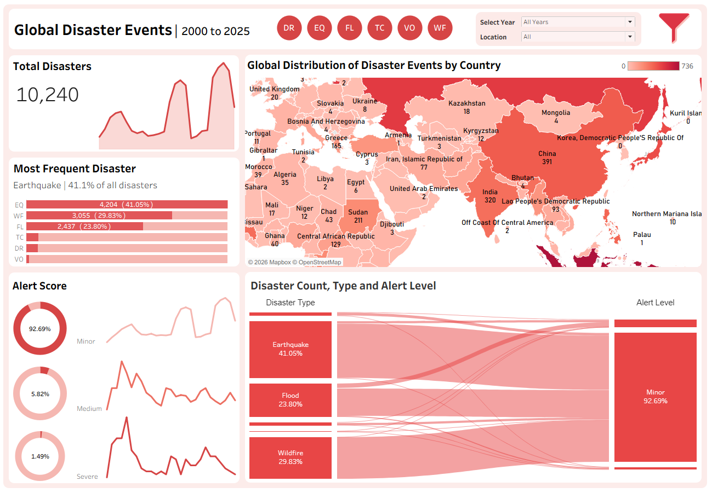

#  Disaster Analysis Project

##  Project Overview
This is an end-to-end data analysis project focused on understanding global disaster patterns. The project covers the complete data pipeline including data cleaning, transformation, storage, analysis, and visualization using Excel, Python, PostgreSQL, and Tableau.

---

##  Objectives
- Analyze disaster distribution across countries
- Understand alert level patterns (Minor, Moderate, Severe)
- Transform raw, unstructured data into a structured analytical dataset
- Build an interactive Tableau dashboard for insights

---

##  Tools & Technologies
- **Excel** (Data cleaning, lookup functions, preprocessing)
- **Python** (Pandas, Regex, PyCountry)
- **PostgreSQL** (Data storage & querying)
- **Tableau** (Dashboard & visualization)
- **GitHub** (Version control & portfolio)

---

## 📊 Data Preparation (Excel)

Initial data cleaning and structuring were performed in Excel before further processing.

### 🔧 Key Tasks:
- Removed duplicates and handled missing values  
- Standardized column formats and cleaned text fields  
- Used **VLOOKUP / XLOOKUP** to merge and validate data across sheets  
- Applied functions such as:
  - `TRIM()`, `CLEAN()` → text cleaning  
  - `LEFT()`, `RIGHT()`, `MID()` → text extraction  
  - `IF()` → conditional categorization  
  - `CONCAT()` / `&` → combining fields  
- Organized raw data into structured tabular format  
- Used filters and pivot tables for quick validation and exploration  

---

## 🧹 Data Cleaning & Preprocessing (Python)

Performed data cleaning and transformation using Python:

- Cleaned **Country** column by splitting multiple countries into separate rows and standardizing names  
- Processed **Impact Description** to remove HTML and extract structured data using regex  
- Created new features such as **Impact Zone** and **Impact Category**  
- Standardized **Population Exposure** values into usable format  
- Generated unique **Disaster Event ID**  
- Handled missing values and ensured consistent formatting  

---

## 🗄️ Data Storage & SQL Analysis (PostgreSQL)

- Loaded cleaned data into PostgreSQL  
- Wrote SQL queries to:
  - Calculate total disasters  
  - Analyze alert level distribution  
  - Identify top countries by disaster count  
  - Generate KPIs for dashboard  

---

## 📊 Tableau Dashboard

An interactive dashboard was built to visualize disaster insights:

### Key Features:
- Global map showing disaster distribution  
- Alert level KPI (% Minor, Moderate, Severe)  
- Dynamic filtering by country and year  
- Trend analysis of disaster events  
- Interactive UI with custom buttons and highlights  

---

## 📸 Dashboard Preview

---

## 🔍 Key Insights
- Certain countries contribute significantly to global disaster counts  
- Alert level distribution highlights risk patterns  
- Disaster trends vary across regions and time  

---

## 🚀 How to Use
1. Run the Python notebook to clean data  
2. Execute SQL queries in PostgreSQL  
3. Open Tableau file (`.twbx`) to explore dashboard  

---

## 👤 Author
**Waqar**  
Data Analyst | Python • SQL • Tableau  
Passionate about turning data into meaningful insights and continuously learning  

---

## 📌 Tags
#Tableau #DataAnalytics #Python #SQL #Excel #DataVisualization #BI #PortfolioProject

